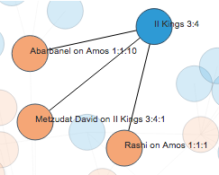

# sefaria-connections

## About
This project was designed using [Sefaria.org's](https://www.sefaria.org/?home) api and D3.js
to show second degree connections between texts.
That is, not just where one text is linked to a second text,
but also texts that the second text links to.
This allows a user to discover if texts talking talking about a text aggregate around other texts.

As an example, `Any time Amos 1:1 is referenced in a/the Commentary which in turn references a/the Tanakh` yields:

When Rashi and Abarbanel talk about Amos 1:1 they also mention II Kings 3:4, and when Metzudat David talks about II Kings 3:4, Amos 1:1 is also mentioned. This is because of the use of נֹקֵד 'sheep breeder' in both texts.

## Tips
Select a biblical text from the top menu; this will be the central purple node.
Then select a type of link (e.g. Commentary, Talmud) from the next menu; these will be the orange nodes.
Then select a type of secondary link (e.g. Tanakh, Midrash) from the next menu; these will be the blue nodes.

The more specific the query, the more precise and manageable the results.
You can zoom in and out with your trackpad or your mousewheel.
For heavily linked passages, like `Genesis 1:1`, a query can return hundreds of nodes.
Nodes can be dragged around the screen for ease of viewing.
Hovering over a specific node will highlight that node and its connections.
The text of each node is also a hyperlink to that text on [Sefaria.org](https://www.sefaria.org/?home).

## Contribute
Please feel free to mark issues, fork, and make pull requests!

